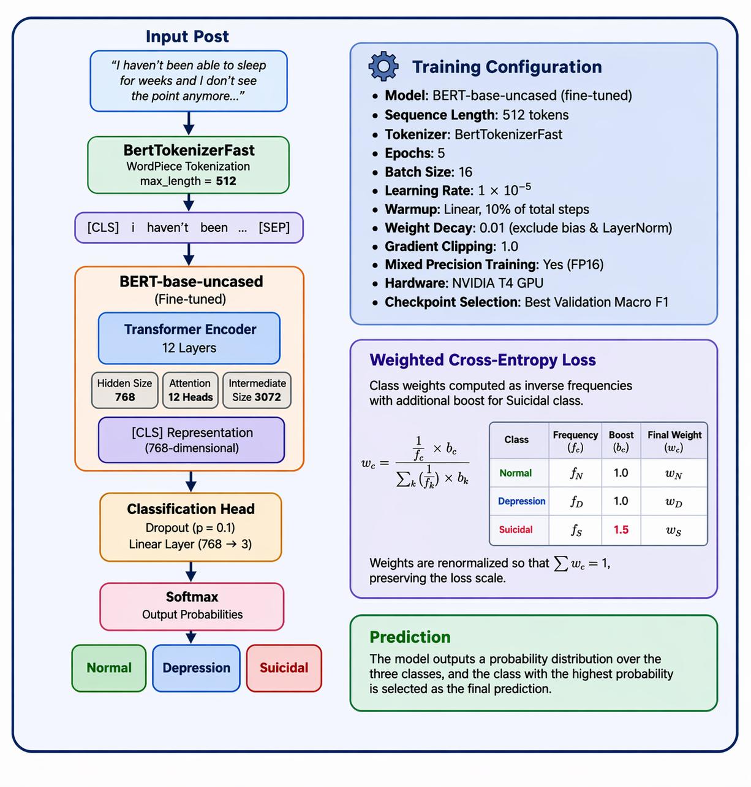

# wellBERT: A Lightweight BERT Model for Detecting Depression and Suicidal Ideation in Text

---

## Overview

This repository implements a full NLP pipeline for three-class mental health
classification of social media posts (**Normal**, **Depression**, **Suicidal**).
The project evaluates ten modeling approaches — from a rule-based VADER baseline
to **WellBERT**, a lightweight fine-tuned BERT-base-uncased model with weighted
cross-entropy loss — on a 42,399-post dataset sourced from Reddit, Twitter, and
a chatbot corpus (Sarkar, 2024).

The central challenge is the **Depression–Suicidal boundary**: two conditions
with overlapping language but vastly different clinical risk. wellBERT addresses
this with an asymmetric loss function that applies a 1.5× weight boost on the
Suicidal class to prioritize recall where it matters most clinically.

---

## wellBERT Configuration

<p align="center">
  
</p>
---

## Repository Structure

```
wellbert/
├── config.py               # All hyperparameters, paths, and constants
├── utils.py                # Shared preprocessing, evaluation, and seed helpers
├── phase1_eda.py           # EDA, preprocessing, OOD extraction, and data split
├── phase2_baselines.py     # 8 classical ML baselines — CPU only
├── phase2_llm.py           # Zero-shot LLM baseline — GPU required
├── phase3_wellbert.py      # WellBERT fine-tuning — GPU required
├── phase4_evaluation.py    # OOD, length analysis, error analysis — GPU required
├── requirements.txt        # Python dependencies
├── data/                   # Put your dataset file here (see setup below)
│   └── Combined_Data.csv
└── outputs/                # All figures, CSVs, and model checkpoints go here
    └── splits/             # Train/val/test .npy arrays (auto-created by Phase 1)
```

---

## Getting the Dataset

1. Go to [Kaggle — Sentiment Analysis for Mental Health](https://www.kaggle.com/datasets/suchintikasarkar/sentiment-analysis-for-mental-health)
2. Download the dataset. You will get a single file called `Combined Data.csv`.
3. Rename it to `Combined_Data.csv` (replace the space with an underscore) and place it in your `data/` folder.

That is all. The OOD file (`data/ood.csv`) is generated **automatically** when
you run Phase 1 — it is created by extracting all posts from `Combined_Data.csv`
that do not belong to the three target classes (Normal, Depression, Suicidal).
You do not need to create or download it separately.

---

## Which Approach Should I Use?

| | Local Machine | Google Colab |
|---|---|---|
| **Phase 1** (EDA + splits) | CPU — works on any machine | CPU |
| **Phase 2a** (8 baselines) | CPU — works on any machine | CPU |
| **Phase 2b** (Zero-Shot LLM) | Only if you have a CUDA GPU | T4 GPU (Pro recommended) |
| **Phase 3** (WellBERT) | Only if you have a CUDA GPU | T4 GPU (Pro recommended) |
| **Phase 4** (Evaluation) | Only if you have a CUDA GPU | T4 GPU (Pro recommended) |

> **Recommendation:** If your local machine does not have a CUDA GPU (most Macs
> do not), run Phases 1 and 2a locally, then switch to Google Colab for
> Phases 2b, 3, and 4. If you have a Colab Pro plan, you can run everything
> end-to-end in Colab without switching environments.

---

---

# APPROACH 1 — Running Locally (Terminal)

---

## Local Setup

### Step 1 — Clone the repository

```bash
git clone https://github.com/eshuns/wellBERT.git
cd wellBERT
```

Confirm you are inside the project folder:

```bash
ls
```

You should see:
```
config.py  utils.py  phase1_eda.py  phase2_baselines.py  ...  requirements.txt  README.md
```

---

### Step 2 — Create a virtual environment

```bash
python3 -m venv venv
```

Activate it:

```bash
source venv/bin/activate        # macOS / Linux
# venv\Scripts\activate         # Windows
```

Your terminal prompt will change to show `(venv)` at the beginning:

```
(venv) yourname@Mac wellBERT %
```

> **Important:** Every time you open a new terminal window, you must
> re-activate the virtual environment before running any script:
> ```bash
> source venv/bin/activate
> ```
> If you see `ModuleNotFoundError` errors, the virtual environment is almost
> certainly not active.

---

### Step 3 — Fix the vader-sentiment version

```bash
sed -i '' 's/vader-sentiment>=3.3.2/vader-sentiment==3.2.1.1/' requirements.txt
```

Confirm:

```bash
grep vader requirements.txt
# Should show: vader-sentiment==3.2.1.1
```

---

### Step 4 — Install all dependencies

```bash
pip install -r requirements.txt
```

Download NLTK stopwords (one-time only):

```bash
python3 -c "import nltk; nltk.download('stopwords')"
```

Verify everything installed:

```bash
python3 -c "import torch; import transformers; import sklearn; import nltk; import vader_sentiment; print('All packages installed correctly')"
```

---

### Step 5 — Place your data file

Create the `data/` folder inside the project:

```bash
mkdir -p data
```

Then download `Combined Data.csv` from Kaggle and drop it into the `data/`
folder. Rename it to `Combined_Data.csv` (replace the space with an underscore)
when saving.

> **Note:** The rename is required — the space in the original filename causes
> a FileNotFoundError.

Your folder should look like this:

```
wellBERT/
└── data/
    └── Combined_Data.csv
```

That is all. The `ood.csv` file is generated automatically when you run Phase 1.

---

## Running the Pipeline Locally

> Always confirm `(venv)` is in your terminal prompt before running any script.
> Run phases in order — each phase depends on outputs from the previous one.

---

### Phase 1 — EDA, OOD Extraction, and Data Splitting (CPU · ~1 minute)

```bash
python3 phase1_eda.py
```

**What it does:**
- Loads the full dataset and filters to the three target classes
- **Automatically creates `data/ood.csv`** by extracting all posts from the
  remaining classes — used in Phase 4 for out-of-distribution robustness testing
- Generates 3 EDA figures: class distribution, token lengths, top word heatmap
- Applies two preprocessing pipelines (classical ML and transformer)
- Creates a stratified 70/15/15 train/val/test split
- Saves all split arrays to `outputs/splits/`

**Expected output:**
```
OOD file saved: data/ood.csv
  10,282 posts across 4 OOD classes:
    Anxiety              : 3,841
    Bipolar              : 2,777
    Stress               : 2,587
    Personality disorder : 1,077

Full dataset : 52,681 rows
3-class subset: 42,399 rows
  Normal      : 16,343  (38.5%)
  Depression  : 15,404  (36.3%)
  Suicidal    : 10,652  (25.1%)
...
Splits saved to: outputs/splits/
Phase 1 complete.
```

**Files saved:**
```
data/ood.csv                         ← auto-generated OOD file
outputs/fig1_class_distribution.png
outputs/fig2_token_length.png
outputs/fig3_top_words_heatmap.png
outputs/eda_summary.csv
outputs/splits/X_train.npy   X_val.npy   X_test.npy
outputs/splits/X_train_raw.npy  X_val_raw.npy  X_test_raw.npy
outputs/splits/y_train.npy   y_val.npy   y_test.npy
```

---

### Phase 2a — Baseline Models (CPU · ~5–15 minutes)

```bash
python3 phase2_baselines.py
```

Trains and evaluates VADER, LR (BoW), LR (TF-IDF), LinearSVM, Naive Bayes,
LSA+LR, Decision Tree, and Random Forest. Prints a full classification report
for each model as it runs.

**Files saved:**
```
outputs/splits/preds_vader.npy  preds_lr_bow.npy  preds_lr_tfidf.npy
outputs/splits/preds_svm.npy    preds_nb.npy      preds_dt.npy
outputs/splits/preds_rf.npy     preds_lsa.npy
outputs/fig4_confusion_matrices.png
outputs/fig5_f1_comparison.png
outputs/fig6_dep_sui_confusion.png
outputs/phase2_results_summary.csv
```

---

### Phase 2b — Zero-Shot LLM (CUDA GPU required · ~10–15 minutes)

```bash
python3 phase2_llm.py
```

**File saved:** `outputs/splits/preds_llm.npy`

---

### Phase 3 — WellBERT Fine-Tuning (CUDA GPU required · ~30 minutes)

```bash
python3 phase3_wellbert.py
```

**Files saved:**
```
outputs/bert_best512.pt
outputs/splits/preds_bert512.npy
outputs/bert_confusion512.png
outputs/fig_full_comparison.png
outputs/phase3_results_summary512.csv
```

---

### Phase 4 — Evaluation and Analysis (CUDA GPU required · ~10 minutes)

```bash
python3 phase4_evaluation.py
```

**Files saved:**
```
outputs/fig_length_analysis512.png
outputs/fig_ood_robustness512.png
outputs/phase4_efficiency512.csv
outputs/phase4_ood_results512.csv
outputs/phase4_error_analysis512.csv
```

---

---

# APPROACH 2 — Running on Google Colab

Use this approach if your local machine does not have a CUDA GPU.
A **Colab Pro** plan is strongly recommended for Phases 3 and 4.

---

## Colab Setup

### Step 1 — Update config.py before uploading

Open `config.py` on your local machine and update these three lines:

```python
DATA_PATH  = "/content/drive/MyDrive/WellBERT/Combined_Data.csv"
OOD_PATH   = "/content/drive/MyDrive/WellBERT/data/ood.csv"
OUT_DIR    = "/content/drive/MyDrive/WellBERT/outputs"
```

---

### Step 2 — Upload your files to Google Drive

Create a folder called `WellBERT` in your Google Drive and upload:

```
MyDrive/WellBERT/
├── config.py                  ← paths updated in Step 1
├── utils.py
├── phase1_eda.py
├── phase2_baselines.py
├── phase2_llm.py
├── phase3_wellbert.py
├── phase4_evaluation.py
├── requirements.txt
└── Combined_Data.csv          ← renamed from "Combined Data.csv"
```

That is all. Do not upload `ood.csv` — Phase 1 creates it automatically.

---

### Step 3 — Open Colab and enable GPU

Go to [colab.research.google.com](https://colab.research.google.com), create a
new notebook, then click **Runtime → Change runtime type → T4 GPU → Save**.

---

### Step 4 — Mount Google Drive

```python
from google.colab import drive
drive.mount('/content/drive')
```

---

### Step 5 — Navigate to your project folder

```python
import os
os.chdir('/content/drive/MyDrive/WellBERT')
!ls
```

---

### Step 6 — Install dependencies

```python
!pip install -r requirements.txt -q
import nltk
nltk.download('stopwords')
```

---

## Running the Pipeline on Colab

### Phase 1 — EDA, OOD Extraction, and Data Splitting (CPU · ~1 minute)

```python
%run phase1_eda.py
```

This also creates `ood.csv` automatically in your Drive folder.

### Phase 2a — Baseline Models (CPU · ~5–15 minutes)

```python
%run phase2_baselines.py
```

### Phase 2b — Zero-Shot LLM (T4 GPU · ~10–15 minutes)

> ⚠️ Run in a **separate Colab session** from Phase 3.

```python
%run phase2_llm.py
```

### Phase 3 — WellBERT Fine-Tuning (T4 GPU · ~30 minutes)

> ⚠️ **Colab Pro strongly recommended.** Run in a **separate session** from Phase 2b.

```python
%run phase3_wellbert.py
```

### Phase 4 — Evaluation and Analysis (T4 GPU · ~10 minutes)

```python
%run phase4_evaluation.py
```

---

---

## Reproducibility

All random seeds are fixed at `SEED = 42` in `config.py`:

```python
os.environ["PYTHONHASHSEED"] = "42"
random.seed(42)
numpy.random.seed(42)
torch.manual_seed(42)
torch.cuda.manual_seed_all(42)
torch.backends.cudnn.deterministic = True
torch.use_deterministic_algorithms(True, warn_only=True)
os.environ["CUBLAS_WORKSPACE_CONFIG"] = ":4096:8"
```

Run all phases in order from a clean state. Do not skip phases or re-run
them out of order.

---

## Troubleshooting

**`(venv)` is not showing in my terminal prompt**
```bash
source venv/bin/activate
```

**`ModuleNotFoundError: No module named 'torch'` (or any module)**

Virtual environment not active. Confirm `(venv)` is in your prompt, then:
```bash
pip install -r requirements.txt
```

**`ERROR: Could not find a version that satisfies the requirement vader-sentiment>=3.3.2`**
```bash
sed -i '' 's/vader-sentiment>=3.3.2/vader-sentiment==3.2.1.1/' requirements.txt
pip install vader-sentiment==3.2.1.1
pip install -r requirements.txt
```

**`FileNotFoundError: No such file or directory: 'data/Combined_Data.csv'`**

Your data file is not in the right place. Create the `data/` folder and drop
`Combined_Data.csv` into it. Make sure the filename uses an underscore, not a
space — rename it from `Combined Data.csv` to `Combined_Data.csv` when saving.

**`TypeError: Image data of dtype object cannot be converted to float`**

Download the latest `phase1_eda.py` from this repository.

**`TypeError: only integer scalar arrays can be converted to a scalar index`**

Download the latest `phase1_eda.py` from this repository.

**`RuntimeError: No GPU detected` when running Phase 3 or 4**

Use Google Colab with a T4 GPU as described in Approach 2 above.

**Colab session disconnected during Phase 3**

Upgrade to Colab Pro. Checkpoints are saved to Drive after every epoch that
improves validation macro F1.

---

## Outputs Reference

| File | Description |
|---|---|
| `data/ood.csv` | Auto-generated OOD dataset (Phase 1) |
| `outputs/fig1_class_distribution.png` | Class distribution bar chart |
| `outputs/fig2_token_length.png` | Token-length ECDF and bucket breakdown |
| `outputs/fig3_top_words_heatmap.png` | Top word frequency heatmap per class |
| `outputs/fig4_confusion_matrices.png` | 3×3 grid of baseline confusion matrices |
| `outputs/fig5_f1_comparison.png` | Per-class F1 comparison — baselines |
| `outputs/fig6_dep_sui_confusion.png` | Depression ↔ Suicidal confusion rates |
| `outputs/bert_confusion512.png` | WellBERT confusion matrix |
| `outputs/fig_full_comparison.png` | All 10 models — per-class F1 |
| `outputs/fig_length_analysis512.png` | Performance by text length |
| `outputs/fig_ood_robustness512.png` | OOD robustness figure |
| `outputs/bert_best512.pt` | WellBERT best checkpoint |
| `outputs/splits/*.npy` | Train/val/test split arrays and predictions |
| `outputs/*.csv` | Results summary tables |

---
